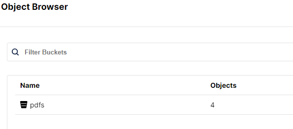

# Projet final : DVF (Demandes de Valeurs Foncières)


Application React et Java permettant à un utilisateur de rechercher les données de valeurs foncières (DVF) d'un bien immobilier à partir de sa longitude et latitude.

L’application DVF « officielle » est accessible à l’adresse suivante :
https://explore.data.gouv.fr/immobilier?onglet=carte&filtre=tous&level=section&lat=46.30000&lng=2.00000&zoom=16.00

Elle se base sur un ensemble de données contenant actuellement 1 532 718 entrées.


## Installation

Assurez vous d'avoir lancer votre système docker (par exemple : docker desktop).

```bash
git clone https://github.com/Bertrand2808/DVFApplication.git
# Assurez vous de vous trouver dans le dépôt cloné où se trouve le docker-compose.yml
cd DVFApplication/dvf-backend/doc/
gunzip full.csv.gz # Dézipper le fichier full.csv
cd ..
cd .. # revenir dans le dossier DVFApplication
docker-compose up --build # Lancer le docker
```


## Utilisation

Une fois le docker lancée, il faut se rendre à l'adresse suivante pour consulter l'interface web : http://localhost:5173/

Choississez une longitude et une latitude ainsi que le rayon (via le formulaire ou directement via la map) pour obtenir les données DVF correspondantes sous format PDF.


Cliquez sur le bouton "Soumettre" pour obtenir le PDF qui s'ouvrira dans un nouvel onglet.


A noter que vous pouvez à tout moment retrouver les pdfs générer dans le serveur de fichier MiniO. Pour cela, rendez vous sur la page : http://localhost:8900/browser

Vous arriverez sur cette interface :


Entrez les identifiants suivants pour vous connecter :
**Username :** minioadmin / **Password :** minioadmin

Vous retrouverez le bucket qui contient les pdfs précédemment générés.



## Technologies utilisées

- React
- Java
- Docker
- Minio

## Organisation du projet

Le projet est divisé en deux parties : le front-end et le back-end.
Vous pourrez à tout moment consulter les anciens commits et merges pour voir l'évolution du projet aux dépôts suivants :
- Front : https://github.com/Bertrand2808/DVF-front
- Back : https://github.com/Bertrand2808/dvf-backend
- Trello : https://trello.com/b/ogpwtTqw/projet-dvf

## Documentation

Vous pourrez retrouver les différents diagrammes StarUml demandé dans le dossier `doc` à la racine du projet `dvf-backend`.
Une fois ouvert avec StarUml, vous pouvez les retrouver dans la barre de recherche :


## Authors
-Aurélien (https://github.com/nandreau)

-Bertrand (https://github.com/Bertrand2808)
