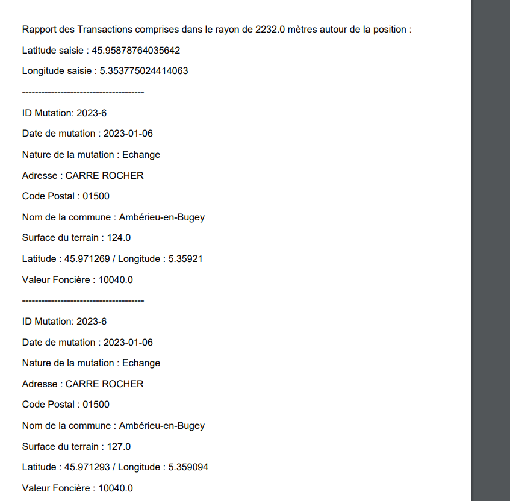

# Projet final : DVF (Demandes de Valeurs Foncières)


Application React donnant accès aux données de DVF en produisant un
PDF.

L’application DVF « officielle » est accessible à l’adresse suivante :
https://explore.data.gouv.fr/immobilier?onglet=carte&filtre=tous&level=section&lat=46.30000&lng=2.00000&zoom=16.00

Elle se base sur un ensemble de données contenant actuellement 1 532 718 entrées.

Ce dépôt git est l'interface front de l'application DVF Java que vous pouvez retrouver à l'adresse suivante : https://github.com/Bertrand2808/dvf-backend.git


## Installation

```bash
git clone https://github.com/Bertrand2808/DVF-front.git
cd dvf
npm install
npm run dev # pour lancer l'application
```


## Utilisation

Une fois l'application lancée, il faut se rendre à l'adresse suivante pour consulter l'interface : http://localhost:5173/

Penser à bien avoir lancer l'application Java avant de lancer l'application React.

Choississez une longitude et une latitude ainsi que le rayon (via le formulaire ou directement via la map) pour obtenir les données DVF correspondantes sous format PDF.



## Authors
-Aurélien (https://github.com/nandreau)

-Bertrand (https://github.com/Bertrand2808)
